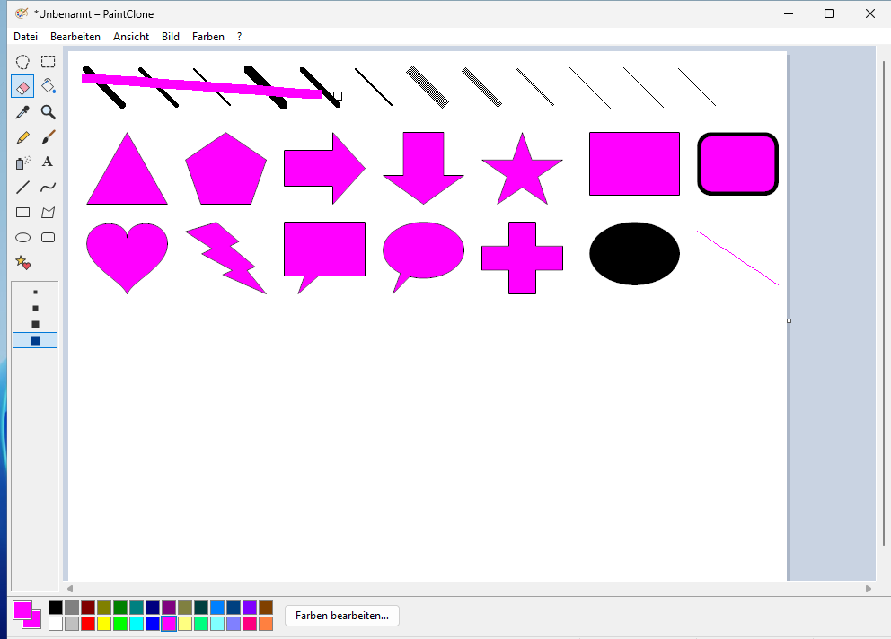

# PaintClone

Ein Malprogramm nach dem Vorbild von Microsoft Paint – als native **64-Bit-Windows-Anwendung** in C++17
(Win32-API, GDI und GDI+), ohne Laufzeitabhängigkeiten. Oberfläche komplett auf Deutsch.

Die fertige Programmdatei liegt unter [`bin/PaintClone.exe`](bin/PaintClone.exe) und kann direkt gestartet werden
(Windows 10/11, x64).



## Funktionen

**Werkzeuge** (Werkzeugleiste links, Optionen darunter)

| Werkzeug | Optionen / Bedienung |
|---|---|
| Freihandauswahl, Auswahl | deckend / transparent (Farbe 2 wird durchsichtig); Verschieben, Strg+Ziehen kopiert, Größe über die 8 Griffe, Pfeiltasten verschieben (Umschalt = 10 Px) |
| Radierer/Farbradierer | 4 Größen; rechte Maustaste ersetzt nur Pixel der Farbe 1 durch Farbe 2 |
| Farbfüller | füllt zusammenhängende Fläche gleicher Farbe |
| Farbe auswählen (Pipette) | links → Farbe 1, rechts → Farbe 2, kehrt danach zum vorigen Werkzeug zurück |
| Lupe | links vergrößern, rechts verkleinern; feste Stufen 1×–8× im Optionsbereich |
| Stift, Pinsel, Sprühdose | Pinsel: 4 Formen × 3 Größen; Sprühdose: 3 Größen |
| Text | Textfeld aufziehen, Schriftart/-größe/fett/kursiv/unterstrichen/durchgestrichen in der Textsymbolleiste, deckender oder transparenter Hintergrund |
| Linie, Kurve | 5 Linienbreiten; Kurve: Linie ziehen, dann zweimal biegen |
| Rechteck, Vieleck, Ellipse, abgerundetes Rechteck | Umriss / Umriss + Füllung / nur Füllung, 5 Linienbreiten |
| Formen | 18 Formen (Dreiecke, Raute, Vielecke, Pfeile, Sterne, Herz, Blitz, Legenden, Kreuz) |

Rechtsklick in eine Auswahl öffnet ein Kontextmenü (Ausschneiden, Kopieren, Zuschneiden, Drehen, Größe ändern …).
Linke Maustaste zeichnet mit Farbe 1, rechte mit Farbe 2. Umschalttaste erzwingt Quadrate/Kreise bzw. 45°-Linien.
Esc bricht den laufenden Vorgang ab, eine zweite Maustaste während des Ziehens ebenfalls (wie in Paint).

**Bild**: Spiegeln/Drehen, Größe ändern und Zerren (Prozent oder Pixel, Seitenverhältnis, Neigen in Grad),
Zuschneiden, Farben umkehren, Attribute (Breite/Höhe in Pixel, cm oder Zoll), Bild löschen.
Alle Bildbefehle wirken auf die Auswahl, wenn eine besteht. Die Leinwand lässt sich zusätzlich an den Griffen
rechts/unten mit der Maus vergrößern oder verkleinern.

**Datei**: Öffnen (PNG, BMP, JPEG, GIF, TIFF, ICO; Ausrichtung aus EXIF wird berücksichtigt), Speichern als
PNG, 24-Bit-BMP, JPEG, GIF, TIFF, zuletzt verwendete Bilder, Seite einrichten, Drucken, als Desktophintergrund
(Füllen/Kacheln/Zentrieren), Drag & Drop, Öffnen per Befehlszeile.

**Bearbeiten**: Rückgängig/Wiederholen (bis 50 Schritte), Ausschneiden, Kopieren, Einfügen (auch Bilddateien aus
dem Explorer), Auswahl löschen, Alles markieren, Kopieren nach Datei, Einfügen aus Datei.

**Ansicht**: Werkzeugleiste, Farbpalette, Statusleiste, Textsymbolleiste ein-/ausblenden; Zoom 12,5 %–800 %
(auch Strg+Mausrad), An Fenster anpassen, Gitternetz ab 400 %, Vollbild (F11), Kantenglättung für Formen.

**Farben**: Palette mit 28 Farben (Doppelklick bearbeitet ein Feld), Farbe 1/2 tauschen (Klick auf die
Farbfelder oder Taste X), Farbauswahldialog mit eigenen Farben, Standardpalette wiederherstellen.

Einstellungen (Fensterposition, Werkzeugoptionen, Schrift, Palette, zuletzt verwendete Bilder, Druckränder)
werden in `%APPDATA%\PaintClone\PaintClone.ini` gespeichert. Hohe DPI-Werte und mehrere Monitore mit
unterschiedlicher Skalierung werden unterstützt (Per-Monitor-V2).

Sollte PaintClone abstürzen, schreibt es ein Protokoll nach `%LOCALAPPDATA%\PaintClone\Absturz.txt`.

## Tastenkombinationen

| Taste | Befehl | Taste | Befehl |
|---|---|---|---|
| Strg+N | Neu | Strg+Z / Strg+Y | Rückgängig / Wiederholen |
| Strg+O | Öffnen | Strg+X / C / V | Ausschneiden / Kopieren / Einfügen |
| Strg+S | Speichern | Entf | Auswahl löschen |
| F12 | Speichern unter | Strg+A | Alles markieren |
| Strg+P | Drucken | Strg+R | Spiegeln/Drehen |
| Strg+T | Werkzeugleiste | Strg+W | Größe ändern/Zerren |
| Strg+L | Farbpalette | Strg+Umschalt+X | Zuschneiden |
| Strg+G | Gitternetz | Strg+I | Farben umkehren |
| Strg+Bild auf / ab | Zoom + / − | Strg+E | Attribute |
| Strg+0 | Zoom 100 % | Strg+Umschalt+N | Bild löschen |
| F11 | Vollbild | X | Farbe 1 und 2 tauschen |

## Selbst bauen

**Visual Studio 2019/2022** (mit CMake): `build.bat` im Projektordner ausführen – das Ergebnis landet in
`bin\PaintClone.exe`. Alternativ den Ordner in Visual Studio öffnen („Ordner öffnen“, CMake wird erkannt).

**MinGW-w64**: `cmake -S . -B build -G "MinGW Makefiles" && cmake --build build`

**Crossbuild unter Linux/macOS** mit Zig: `pip install ziglang` und dann `./build.sh`.

Die Tests der Pixelalgorithmen (Füllen, Drehen, Spiegeln, Neigen, Freihandmaske, Linien, Pinsel) laufen auf
jeder Plattform:

```
g++ -std=c++17 -Isrc tests/test_algo.cpp src/algo.cpp -o test_algo && ./test_algo
```

## Automatische Tests

Bei jedem Push baut GitHub Actions das Programm mit Visual Studio, führt die Algorithmus-Tests aus und startet
anschließend einen Oberflächentest auf einem Windows-Rechner ([`tests/smoke.ps1`](tests/smoke.ps1)): Er zeichnet mit
simulierter Maus und Tastatur mit allen Werkzeugen, öffnet die Dialoge, speichert und lädt ein Bild und prüft, dass
das Programm nicht abstürzt – sowohl für den Visual-Studio-Build als auch für `bin/PaintClone.exe`. Wird der
Workflow manuell mit der Option „Bildschirmfotos“ gestartet, landen die Bildschirmfotos im Zweig `ci-screens`.

## Aufbau

| Datei | Inhalt |
|---|---|
| `src/main.cpp` | Hauptfenster, Menübefehle, Layout, Statusleiste, Rückgängig, Einstellungen |
| `src/canvas.cpp` | Zeichenfläche: Darstellung, Zoom, Bildlauf, alle Werkzeuge, Auswahl, Text |
| `src/panels.cpp` | Werkzeugleiste mit Optionsbereich, Farbpalette, Textsymbolleiste, Werkzeugsymbole (Vektorgrafik) |
| `src/dialogs.cpp` | Dialoge, Drucken, Desktophintergrund, Vollbild |
| `src/image.cpp` | Laden/Speichern über GDI+, Zwischenablage, Ausgabe auf den Bildschirm |
| `src/shapes.cpp` | Linien, Kurven und Formen (GDI+) |
| `src/algo.cpp` | Plattformunabhängige Pixelalgorithmen (getestet in `tests/`) |
| `src/PaintClone.rc` | Menüs, Tastenkombinationen, Dialoge, Symbol, Manifest, Versionsinfo |

„Microsoft“ und „Paint“ sind Marken der Microsoft Corporation. PaintClone ist ein eigenständiges Projekt ohne
Verbindung zu Microsoft; Programmsymbol und Werkzeugsymbole sind eigene Entwürfe.
